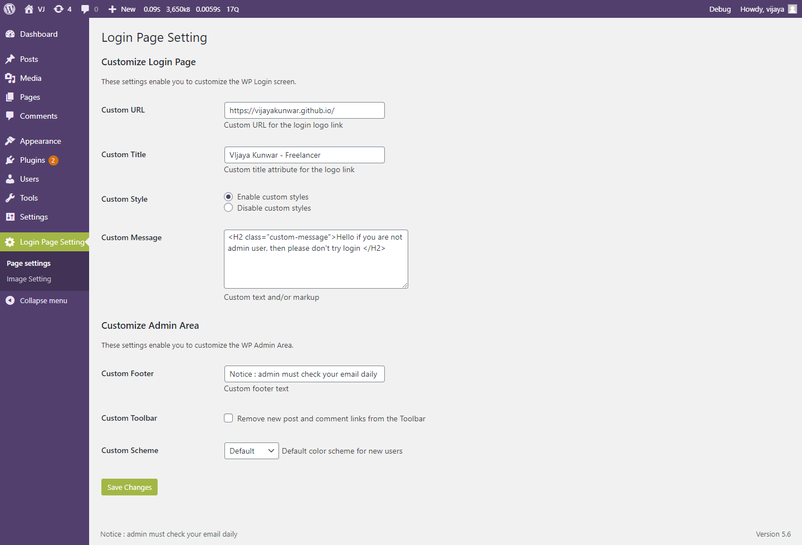
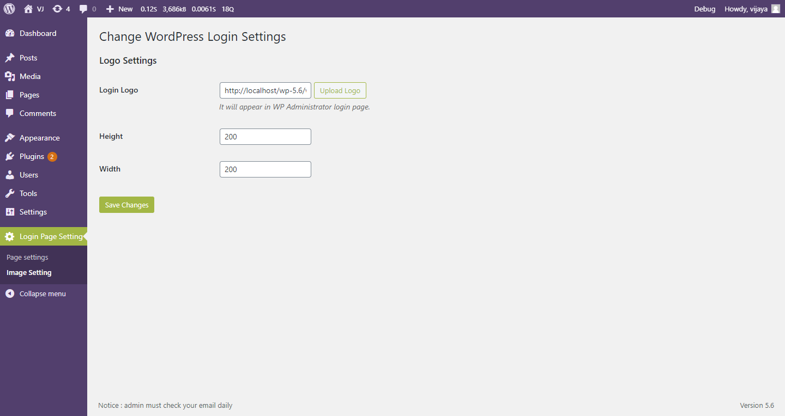
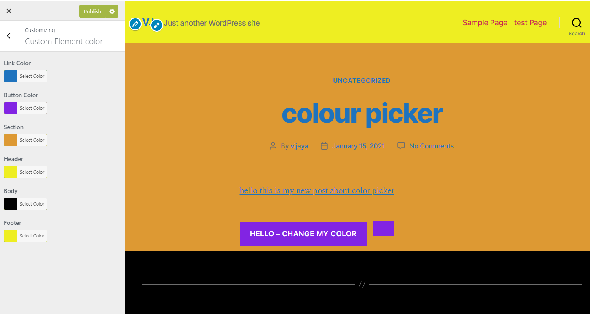
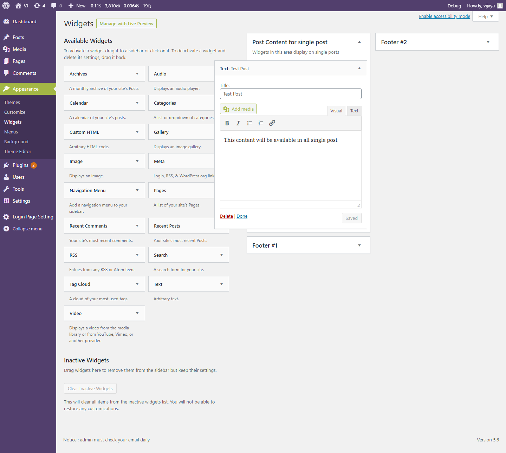
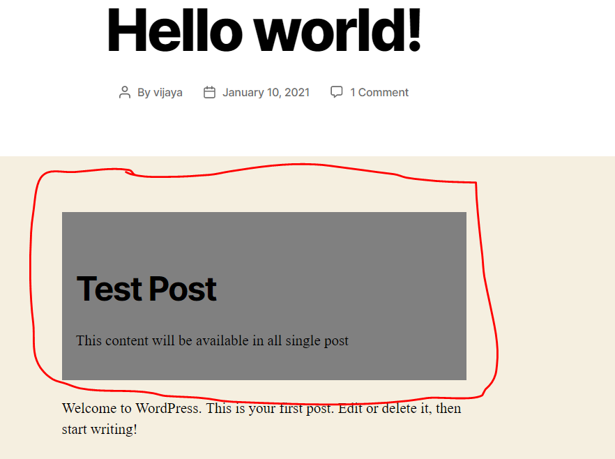

Theme Details

    Plugin Name:       A3 Simple Customizer
    Plugin URI:        https://github.com/vijayakunwar/a3-simple-customizer
    Description:       Provide customize color and add widget to single post.
    Version:           0.1
    Requires at least: 5.2
    Requires PHP:      7.2
    Author:            Vijaya Kunwar
    Author URI:        https://vijayakunwar.github.io/
    License:           GPLv2 or later
    License URI:       https://www.gnu.org/licenses/gpl-2.0.html

Plugin Description 

    Plugin a3-simple-customizer is a simple plugin where admin user can
    customize login page, select custom color for page elements and post same custom content for all single
    post.

Feature List 

    Plugin has 3 main features. All three features with their sub features are mentioned below

1: Login page customizer

    For login page
        Custom image upload for login page logo - designed to palce company logo
        Custom logo link URL - designed to link company home page
        Custom Title
        Custom Style
        Custom message - designed to protect username and password hint
    Remove annoying shaking animation
        For admin area
        Custom footer
        Custom Toolbar
        Custom color Scheme for new user

2: Custom Element color

    Link color
    Button color
    Section color
    Button color
    Header color
    Body color
    Footer color

3: Widget placement in a single post

    Designed to place same content in all post. It can be notice, company profile, video , upcoming events e.t.c

Frequently Asked Questions 

    What Plugin does? / Why the plugin is useful?

        Feature custom login page customization is placed in admin menu and it is designed in such a way that a company
        can place their logo and URL link to home page instead of WordPress logo and URL.
        It Provide login page setting and admin area setting using menu page.
    
        Feature Custom color is placed in theme appearance customization menu. It enable admin user to select custom color
        using color picker pallet for different HTML element such as link, button, article, header, footer. It also
        allow to disable selected color.
    
        Feature custom post for single post is designed such as way that it allows to provide same content in all post.
        This is useful feature that can be used when a content such as text, image, video need to be palced in a post
        that can act as notice to post reader.

    How user can get started with the plugin?

        User just need to follow the instruction to add new plugin
    
        To upload:
            1: Find add new plugin ni Plugin/Add New menu page in admin menu
            2: Upload the zipped plugin folder using Upload Plugin button
            3: Activate the plugin
        To access Custom Login page features
            1: Login page setting main menu is shown in admin menu once plugin installed sucessfully
            2: It has subpage menu page setting and logo setting
        To access custom color customizer
            1: It is placed in Appearance/Customize menu as  Custom Element color sub menu
        To access custom post content
            1: once the plugin is activated, Post Content for single post Metabox is shown
                where we can place available widget such as image, text or video.
            2: Drag and drop needed widget to metabox, save and check one post to see it in effect

    Where user can get help with plugin issues?

        User can get help by sending email on vijaya.kunwar@my.jcu.edu.au

    What should the developer need to know before customizing or upgrading the plugin?
    
        Developer need to know the knowledge and how to implement  Plugin API Action and references
        and using library methods from sub area of
          1: Theme Customization API
          2: Customizing the Login Form
          3: Customizing the Login Form
          4: Using Custom Fields to attach images, links or files to a post easily

Screenshots

    Login page setting
    
        
        
    Login image setting
    
        
        
    Custom Element color
    
        
        
    Custom post widget for single post
    
        
        
         
    

